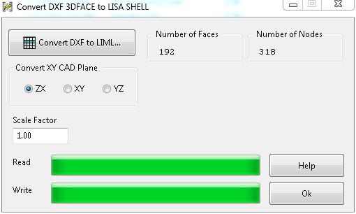
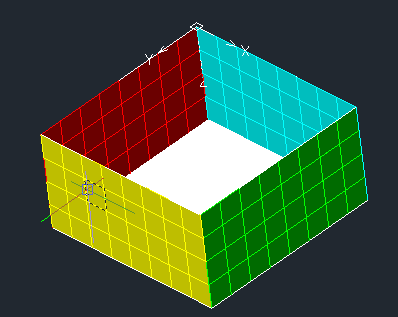
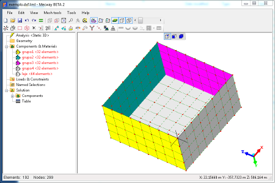

# DXF to LISA

   

Convert DXF **3DFACES** entities to LISA file (**liml**). The layers are separated into groups of elements and you can adjust scale and axes rotation.
	
## Software Features

- Free Software Developed in [Lazarus](https://www.lazarus-ide.org/) tool. 
- Run on **Windows** and **GNU/Linux**.
- Scale adjustment.
- Axes rotation.
- Read the 2007 DXF version.

## Usage

> 1 - Set the scale and plane rotation options
 
> 2 - Click at the button "Convert DXF to LIML"

> 3 - Select the DXF file and confirm

> 4 - Will be created a file named as **[file name].dxf.liml** into the application directory.

> 5 - Open the **liml** file into the [LISA](https://lisafea.com/) or into the [MECWAY](https://mecway.com/) 

## License

[GPLv3](http://www.gnu.org/licenses/)

[Click here to see the license](license.txt)

